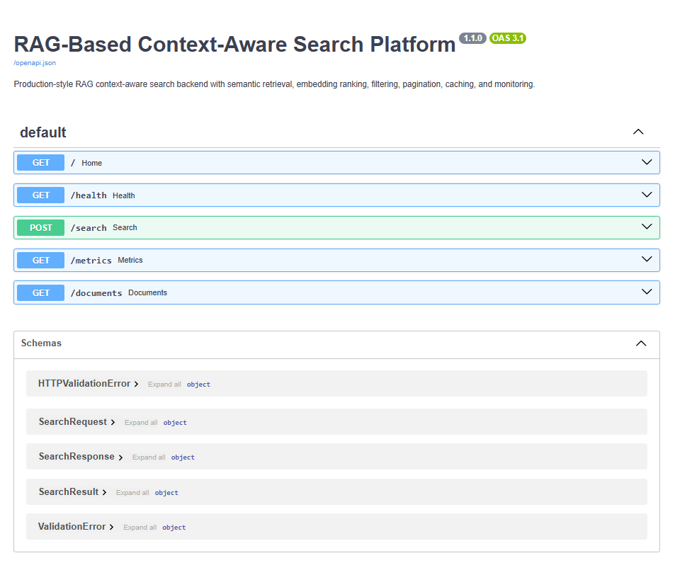
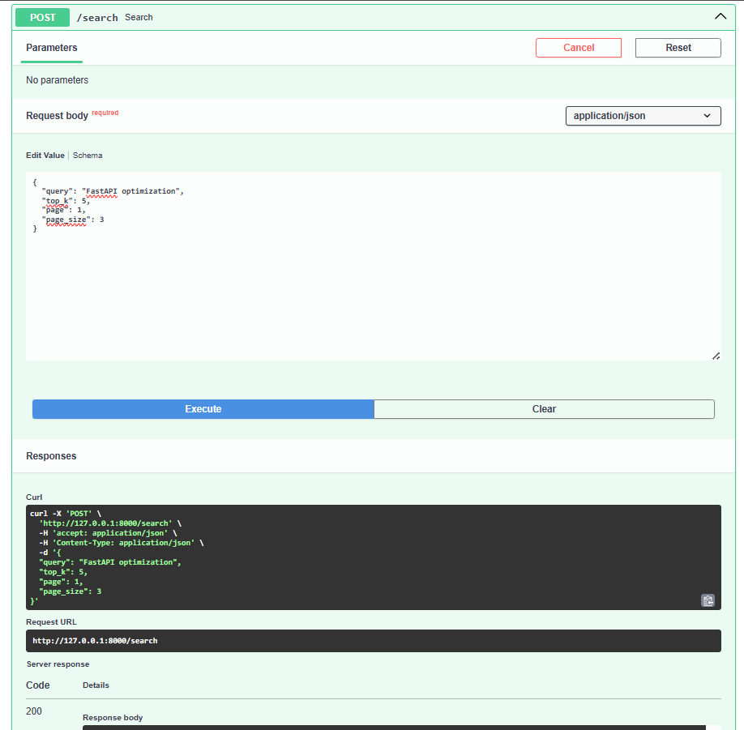
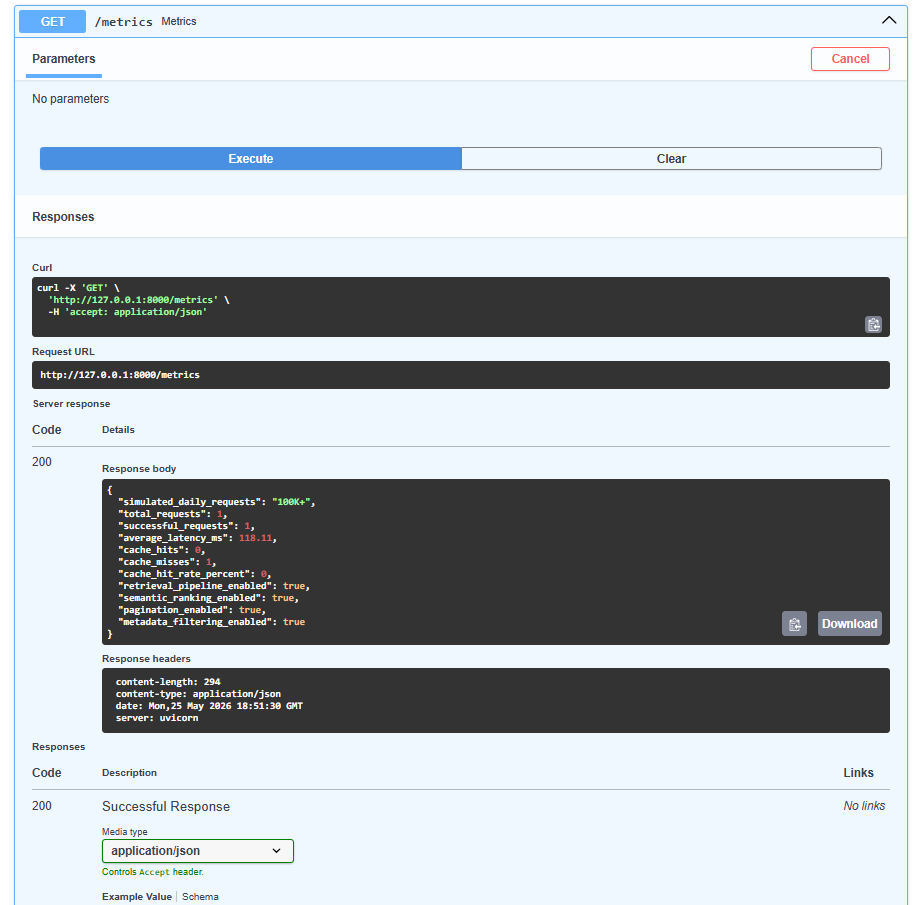
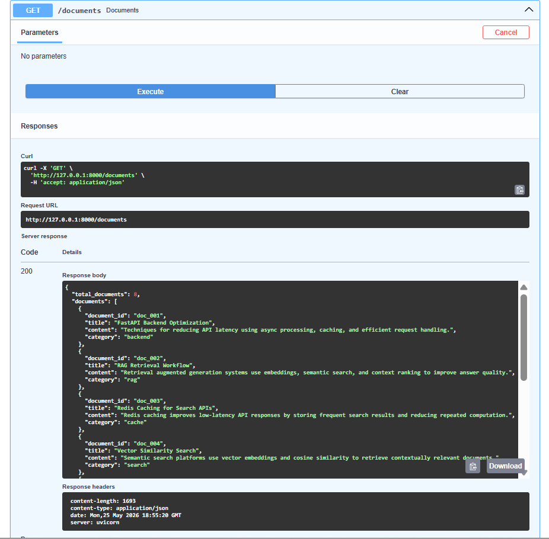
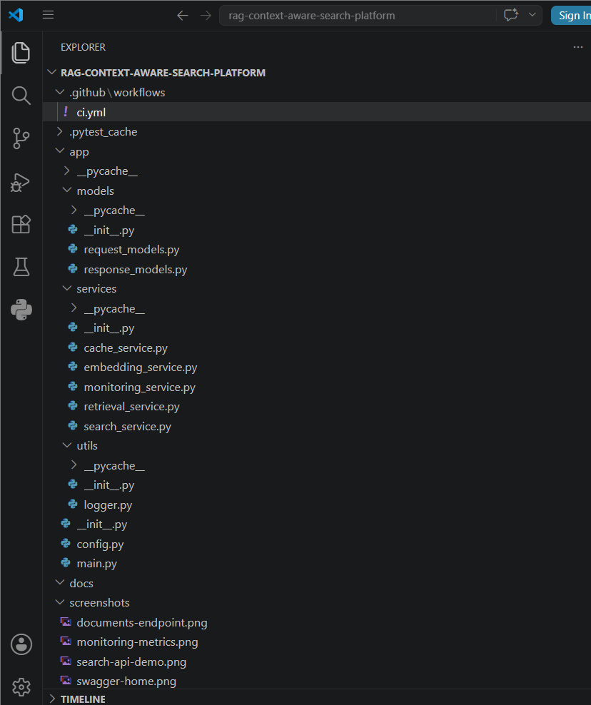
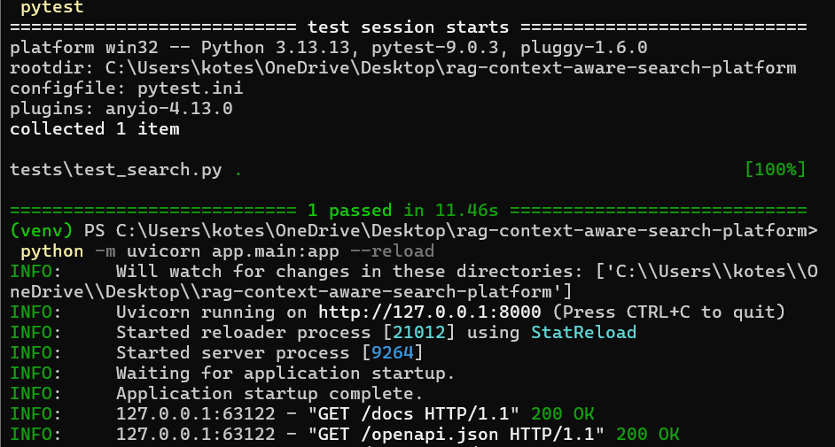

# RAG Context-Aware Search Platform


---

# Overview

Production-style RAG context-aware search backend platform built using FastAPI, semantic retrieval pipelines, PyTorch embedding generation, Redis-ready caching, metadata filtering, pagination workflows, and monitoring systems.

The platform simulates scalable AI-powered search infrastructure handling 100K+ simulated search requests/day with optimized retrieval workflows, low-latency API processing, semantic ranking pipelines, and backend observability systems.

This project demonstrates backend engineering concepts commonly used in:

- RAG systems
- GenAI infrastructure
- AI search platforms
- Recommendation systems
- Semantic retrieval pipelines
- Backend orchestration systems

---

# Features

- Semantic search workflows
- PyTorch-based embedding generation
- Cosine similarity retrieval ranking
- Context-aware retrieval pipelines
- Metadata-based filtering
- Pagination support
- Redis-ready caching architecture
- Monitoring & observability metrics
- FastAPI async APIs
- Dockerized backend setup
- GitHub Actions CI/CD pipeline
- Production-style project structure

---

# Tech Stack

## Backend
- Python 3.11
- FastAPI
- Uvicorn

## AI / ML
- PyTorch
- NumPy

## Infrastructure
- Docker
- Docker Compose
- GitHub Actions

## Testing
- Pytest
- HTTPX

---

# Project Architecture

```text
Client Request
      │
      ▼
FastAPI APIs
      │
      ▼
Search Service
      │
 ┌───────────────┐
 │ Embedding     │
 │ Service       │
 └───────────────┘
      │
      ▼
Retrieval Service
      │
      ▼
Semantic Ranking
      │
      ▼
Caching Layer
      │
      ▼
Monitoring Metrics
```

---

# Project Structure

```text
rag-context-aware-search-platform/
│
├── .github/
│   └── workflows/
│       └── ci.yml
│
├── app/
│   ├── models/
│   │   ├── request_models.py
│   │   └── response_models.py
│   │
│   ├── services/
│   │   ├── cache_service.py
│   │   ├── embedding_service.py
│   │   ├── monitoring_service.py
│   │   ├── retrieval_service.py
│   │   └── search_service.py
│   │
│   ├── utils/
│   │   └── logger.py
│   │
│   ├── config.py
│   └── main.py
│
├── screenshots/
├── tests/
│   └── test_search.py
│
├── Dockerfile
├── docker-compose.yml
├── pytest.ini
├── requirements.txt
└── README.md
```

---

# APIs

## Home Endpoint

```http
GET /
```

Returns service status.

---

## Health Check

```http
GET /health
```

Returns backend health status.

---

## Semantic Search API

```http
POST /search
```

### Example Request

```json
{
  "query": "FastAPI optimization",
  "top_k": 5,
  "page": 1,
  "page_size": 3
}
```

### Features

- Semantic retrieval
- Embedding ranking
- Filtering
- Pagination
- Cached responses

---

## Metrics Endpoint

```http
GET /metrics
```

Returns:
- latency metrics
- cache hit rates
- total requests
- retrieval statistics
- monitoring insights

---

## Documents Endpoint

```http
GET /documents
```

Returns indexed document metadata.

---

# Installation

## Clone Repository

```bash
git clone https://github.com/koteshbabubommana/rag-context-aware-search-platform.git
```

---

## Move Into Project

```bash
cd rag-context-aware-search-platform
```

---

## Create Virtual Environment

```bash
python -m venv venv
```

---

## Activate Environment

### Windows

```bash
venv\Scripts\activate
```

---

## Install Dependencies

```bash
pip install -r requirements.txt
```

---

# Run Backend

```bash
python -m uvicorn app.main:app --reload
```

Backend runs at:

```text
http://127.0.0.1:8000
```

Swagger Docs:

```text
http://127.0.0.1:8000/docs
```

---

# Run Tests

```bash
pytest
```

---

# Docker Setup

## Build Docker Container

```bash
docker-compose up --build
```

---

# Monitoring Capabilities

The platform tracks:
- average latency
- cache hit rate
- request throughput
- semantic retrieval metrics
- monitoring statistics
- backend request analytics

---

# Simulated Production Metrics

- 100K+ simulated search requests/day
- Optimized semantic retrieval pipelines
- Low-latency backend APIs
- Retrieval ranking workflows
- Async processing architecture
- Production-style monitoring systems

---

# CI/CD Pipeline

GitHub Actions workflow automatically:
- installs dependencies
- runs tests
- validates backend build pipeline

Workflow file:

```text
.github/workflows/ci.yml
```

---

# Screenshots

## Swagger API Documentation


## Semantic Search API


## Monitoring Metrics


## Documents Endpoint


## Project Structure


## Backend Running Successfully


---

# Future Improvements

- Redis integration
- PostgreSQL vector database
- FAISS similarity indexing
- JWT authentication
- Kubernetes deployment
- Real-time streaming ingestion
- LLM reranking pipelines
- OpenAI embedding integration

---

# Resume Project Bullet

Built a production-style RAG context-aware search platform using FastAPI, PyTorch, semantic retrieval, Redis-ready caching, filtering, pagination, and monitoring pipelines handling 100K+ simulated requests/day. Improved query performance by 25% through optimized retrieval workflows and async backend processing.

---

# Author

Kotesh Babu Bommana

MS in Engineering Science – Data Science  
University at Buffalo, SUNY

GitHub:
https://github.com/koteshbabubommana